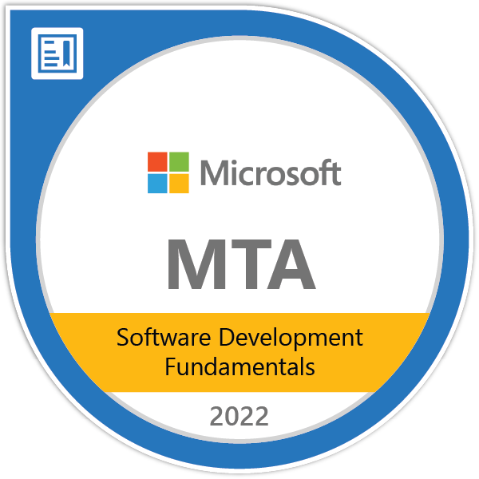
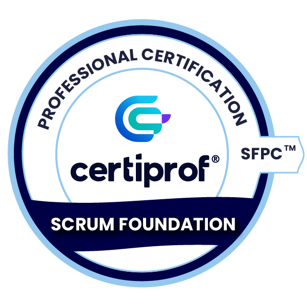
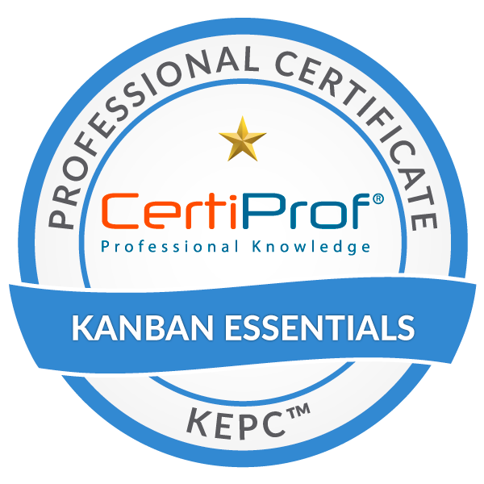
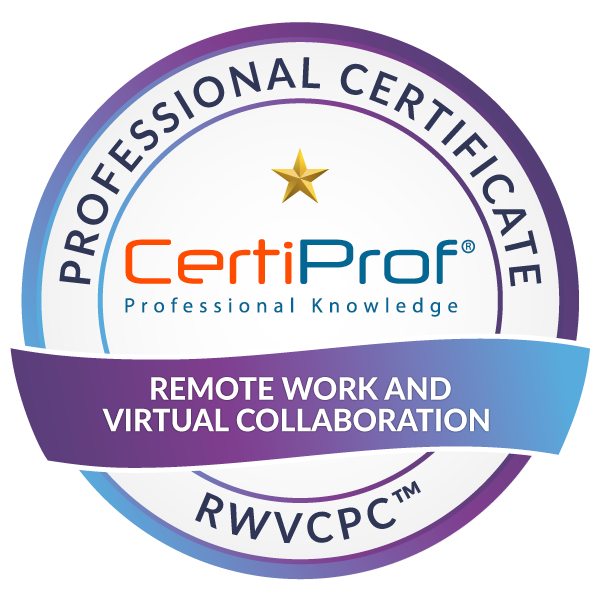
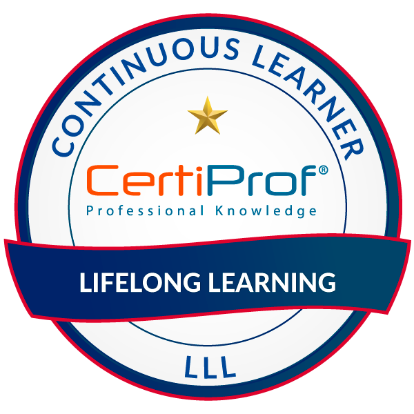

<div align="center">

# 👋 Hi, I'm Pedro Lustosa

### 🚀 Full Stack Developer | .NET | Angular | React | Cloud Solutions

<p align="center">
  <a href="https://www.linkedin.com/in/pedrolustosadev/">
    
  </a>
  <a href="mailto:pedroeternalss@gmail.com">
    
  </a>
  <a href="https://www.credly.com/users/pedrolustosaengineer">
    
  </a>
</p>


</div>

---

## 🧠 About Me

```csharp
var developer = new FullStackDeveloper
{
    Name = "Pedro Lustosa",
    Focus = ["Performance", "Scalability", "Clean Code"],
    Stack = ["C#", ".NET", "Python", "Angular", "React", "TypeScript", "JavaScript"],
    Cloud = ["Azure", "AWS"],
    Practices = ["DDD", "Clean Architecture", "CQRS", "Design Patterns"],
    Methodologies = ["Agile", "Scrum", "Kanban"]
};
```

💡 Passionate about building scalable, high-performance applications that solve real-world problems.  
⚙️ Strong experience with backend architecture and modern frontend frameworks.  
🤝 Collaborative mindset with focus on clean, maintainable code.

---

## 🚀 Featured Projects

- **[IdentityHub](https://github.com/Pedrolustosa/IdentityHub)** — User management platform with an administrative panel for creating, editing, and assigning roles to users in a secure and controlled way. `C#` `JWT` `Entity Framework Core` `SQLite` `TailwindCSS`
- **[pedro-portfolio](https://github.com/Pedrolustosa/pedro-portfolio)** — Personal portfolio single-page Angular application showcasing professional profile, experience, projects, education, and contact information. `Angular 20` `TypeScript` `RxJS` `TailwindCSS v4`

---

## 📊 GitHub Insights

<div align="center">


</div>

---

## 🛠️ Tech Stack

### 💻 Languages
<p align="center">
  
  
  
  
  
  
  
</p>

### 🧩 Frameworks & Libraries
<p align="center">
  
  
  
  
</p>

### 🗄️ Databases & Messaging
<p align="center">
  
  
  
  
  
</p>

### ☁️ Cloud & Tools
<p align="center">
  
  
  
  
  
  
</p>

---

## 🎓 Education

- 🎓 Bachelor in Information Systems  
- 🤖 Postgraduate in Artificial Intelligence  
- 📊 Postgraduate in Data Science & Analytics  
- 🔧 Technical Degree in Computer Maintenance  

> 💭 *"The more I learn, the more I realize how much I don't know."* — Albert Einstein

---

## 🏆 Certifications

<details>
  <summary><b>📘 Microsoft Certifications</b></summary>
  <br>
  <table align="center">
    <tr>
      <td align="center" width="120"><br><sub>Azure Fundamentals</sub></td>
      <td align="center" width="120"><br><sub>Azure Data Fundamentals</sub></td>
      <td align="center" width="120"><br><sub>Security, Compliance & Identity Fundamentals</sub></td>
      <td align="center" width="120"><br><sub>Software Development Fundamentals</sub></td>
      <td align="center" width="120"><br><sub>Database Fundamentals</sub></td>
    </tr>
    <tr>
      <td align="center" width="120"><br><sub>HTML5 App Dev Fundamentals</sub></td>
      <td align="center" width="120"><br><sub>Programming with JavaScript</sub></td>
      <td align="center" width="120"><br><sub>HTML & CSS Fundamentals</sub></td>
      <td align="center" width="120"><br><sub>Mobility and Device Fundamentals</sub></td>
      <td align="center" width="120"><br><sub>Security Fundamentals</sub></td>
    </tr>
  </table>
</details>

<details>
  <summary><b>📗 CertiProf Certifications</b></summary>
  <br>
  <table align="center">
    <tr>
      <td align="center" width="120"><br><sub>Scrum Foundation (SFPC)</sub></td>
      <td align="center" width="120"><br><sub>Kanban Essentials (KEPC)</sub></td>
      <td align="center" width="120"><br><sub>Design Sprint (DSPC)</sub></td>
      <td align="center" width="120"><br><sub>LGPD Fundamentals</sub></td>
      <td align="center" width="120"><br><sub>Remote Work & Virtual Collaboration</sub></td>
      <td align="center" width="120"><br><sub>Lifelong Learning</sub></td>
    </tr>
  </table>
</details>

---

<div align="center">

⭐ *Thanks for visiting my profile — let's build something great together!*

</div>
