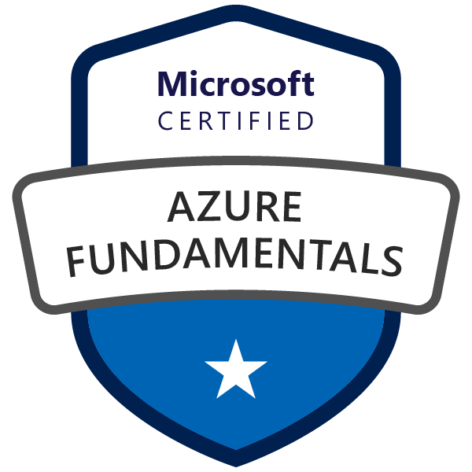
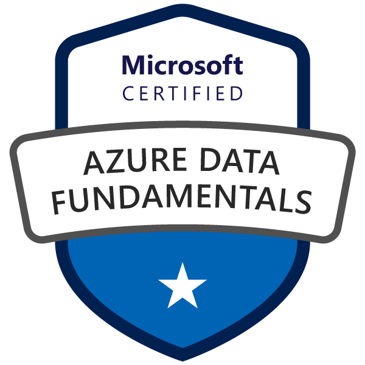
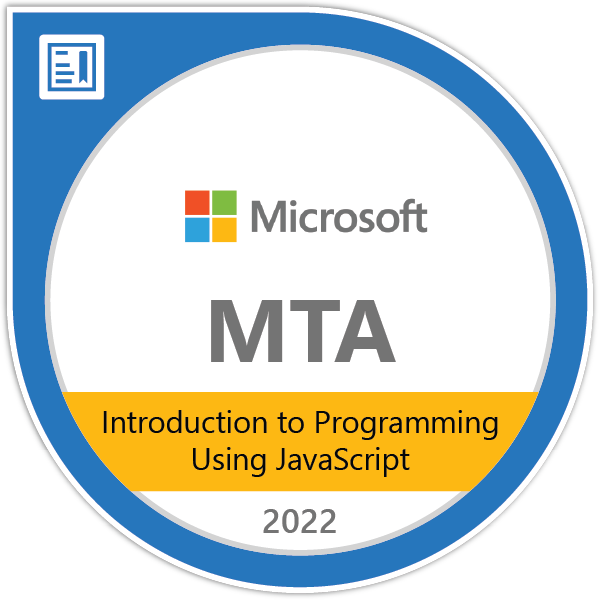
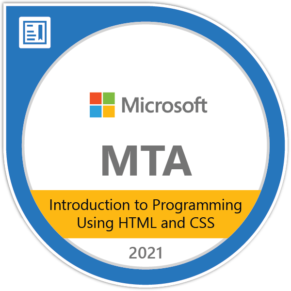
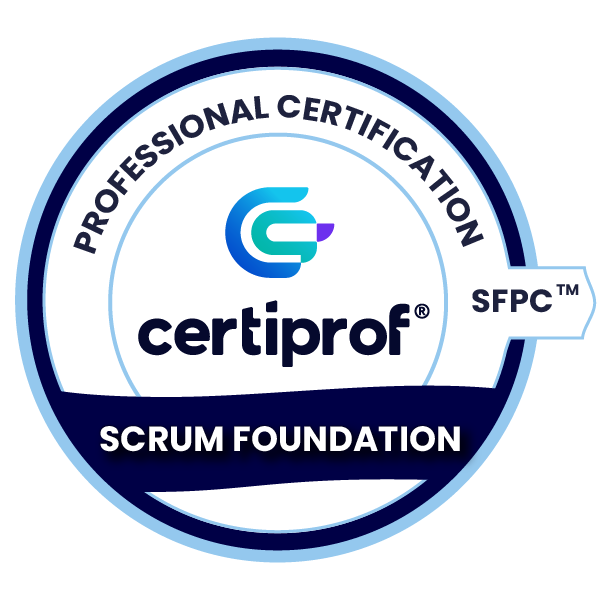
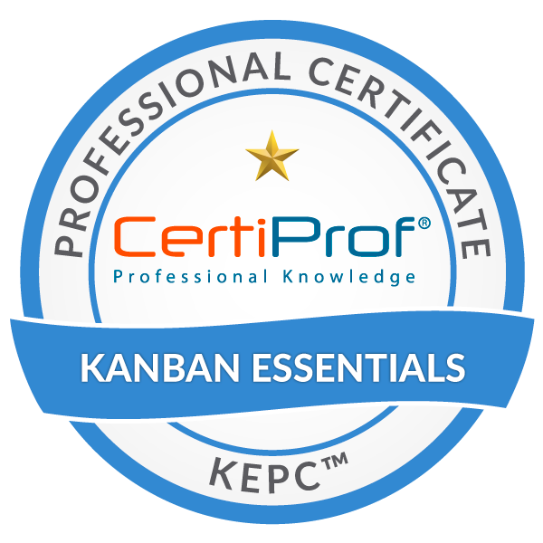

# Pedro Lustosa

**Full Stack Developer** specializing in scalable systems with **.NET**, **Angular**, **React**, and **Cloud**.

 

---

## About

Full Stack Developer with a strong background in building **scalable**, **high-performance** applications across the entire stack — from robust APIs to polished interfaces and cloud infrastructure.

I work primarily with **C# / .NET** on the backend and **Angular / React** on the frontend, applying practices such as **DDD**, **Clean Architecture**, and **CQRS** to keep systems clear, testable, and ready for growth.

Beyond shipping features, I care about **maintainability**, **team collaboration**, and solutions that hold up in real production environments.

| | |
| :--- | :--- |
| **What I build** | End-to-end systems — APIs, web apps, integrations, and cloud-hosted services |
| **How I work** | Clean code, domain modeling, iterative delivery (Agile / Scrum / Kanban) |
| **Where I operate** | Azure & AWS · SQL & NoSQL · messaging with RabbitMQ & Kafka |
| **What I value** | Performance, scalability, readability, and long-term ownership of the codebase |

---

## Tech Stack

### Languages

### Frameworks & Libraries

### Databases & Messaging

### Cloud & Tools

---

## Education

- **Bachelor** — Information Systems
- **Postgraduate** — Artificial Intelligence
- **Postgraduate** — Data Science & Analytics
- **Technical Degree** — Computer Maintenance

> *“The more I learn, the more I realize how much I don't know.”* — Albert Einstein

---

## Certifications

### Microsoft — Cloud & Security

  
  &nbsp;&nbsp;&nbsp;
  
  &nbsp;&nbsp;&nbsp;
  

  <b>Azure Fundamentals</b> · <b>Azure Data Fundamentals</b> · <b>Security, Compliance & Identity</b>

  
<b>Microsoft MTA — Development Fundamentals</b>

   
  

    
    &nbsp;
    
    &nbsp;
    
    &nbsp;
    
  

  

    
    &nbsp;
    
    &nbsp;
    
  

  
<b>CertiProf — Agile, Design & Compliance</b>

   
  

    
    &nbsp;
    
    &nbsp;
    
  

  

    
    &nbsp;
    
    &nbsp;
    
  

---

## GitHub Activity

  
  

  

---

### Let's build something solid

Open to collaborations, technical discussions, and opportunities where architecture and craftsmanship matter.

 

